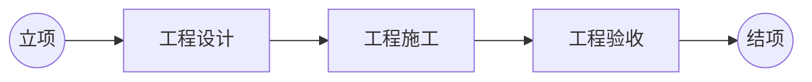
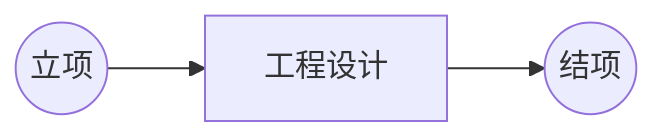
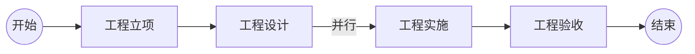

为了完善产品的整体流程设计，重点突出以下几个方面：

1.  需要有清晰的设计环节的定义，从而让使用者能清晰的了解到一个工程的具体工作流程。
2.  设计环节之间的输入输出需要具有连贯性，定义清晰，同时在界面之间能够进行清楚的传递。

## 用户画像

FaaS目前比较确定的目标用户有三类：

*   ZTE HLD团队：主要是售前阶段根据覆盖区域等信息快速出一个BOM，供投标使用。目前使用的工具包括GoogleEarth和CAD。重视绘图效率和体验。
*   ZTE LLD团队：当HLD团队应标成功后，ZTE LLD团队来负责对，进行复勘和微调，评估成本，组织施工单进行施工。最终形成竣工报告发给客户。其关注点是从设计图纸到钱，也就是如何精细化/透明化成本；设计结果如何高效指导施工
*   欧洲新兴的光纤运营商：刚进入光纤领域，管道网络采用租用方式，施工队一般自己管理。关注点在于: a) 快速设计 b) 施工任务的跟踪  c) 快速就绪，同时就绪的数据要能够跟后续的开通保障无缝衔接

## 流程设计

### 网格的定义

参考网格定义的文档。

### 工程整体阶段管理

系统增加一个工程的 阶段 的概念。工程当立项后，工程经理可以对于每个阶段都可以指定对应状态的Manager。

每个状态都有如下几个状态：
**Open**:表示当前状态的Manager可以在对应的管理界面中看到对应工程，并可以进行下一步处理。
**Not Ready**:表示当前状态还未到达，当前状态的Manager无法查看到对应工程。
**Closed**:表示当前状态已经处理完成，当前状态的Manager可以查看到当前工程，但是无法修改。

每个状态下可以创建对应的任务单，当一个状态下所有的任务单都完成了，当前状态才可以完成。

从用户画像可以看到，我们需要支持的工程的实施阶段不是一致的，不同的用户画像对应的实施阶段是不同的，为此，我们需要支持多种不同的工程实施模式，下面，分别进行介绍。

### ZTE LLD团队模式

此模式则是我们系统默认主推的模式，相当于一次详细的工程设计+施工的流程。

#### 工程立项:

*   对应角色：工程经理

*   输入 :

    工程立项的输入可能来源于规划团队的规划申请，也可能直接来自于运营商的直接指定。输入一般会包含如下内容：

    *   工程的范围
    *   工程的设计要求，比如覆盖用户数，光纤利用率，网络结构等。
    *   工程的施工要求，比如安装方式，管道使用原则等

*   流程动作：

    1.  工程经理打开工程管理界面，选择创建一个新的工程，录入工程的基本信息，同时上传工程的立项输入作为附件。

        !\[image-20230103180338898]\(/Users/adir/Library/Application Support/typora-user-images/image-20230103180338898.png)

    2.  工程经理选中新建的工程，选择设置工程范围，有两个选项：选择一个规划网格/绘制一个新的规划网格。系统先暂时支持绘制新的规划网格。

        !\[image-20230103180402813]\(/Users/adir/Library/Application Support/typora-user-images/image-20230103180402813.png)

    3.  同时，这里可以选择对应的工程模式，这里选择ZTE LLD模式。工程经理选中新建的工程，可以看到工程对应分为工程立项，工程设计，工程实施，工程验收4个阶段，其中，工程设计，工程实施，工程验收的负责人都可以进行指定。

        !\[image-20230103180427868]\(/Users/adir/Library/Application Support/typora-user-images/image-20230103180427868.png)

    4.  点击“OK”，然后工程立项完成。这时候，系统自动派发一个设计准备的任务单给之前选中的设计经理。

*   输出：

    系统中的工程，其中包括了可视的工程的范围，以及作为附件的工程的设计，施工要求。同时，自动产生了一个设计准备的任务单给设置的设计经理。

#### 工程设计:

*   对应角色：设计负责人，设计人员

*   输入：系统中的工程

*   流程动作：

    1.  设计负责人打开工程的任务单列表界面，可以看到当前设计负责人的任务单列表，已经有一个自动产生的设计准备的任务单。

        !\[image-20230103180807255]\(/Users/adir/Library/Application Support/typora-user-images/image-20230103180807255.png)

    2.  选择对应的任务单后，点击“设计准备”，根据附件中的设计准则和施工准则等，选择对应的设计方案。

        !\[image-20230103090459843]\(/Users/adir/Library/Application Support/typora-user-images/image-20230103090459843.png)

    3.  选定了对应的设计方案后，可以看到下面会出现设计方案的概要说明。如果没有一个匹配的设计方案，则可以在设计方案的配置界面去进行新的设计方案的添加和维护。

    4.  当设计准备完成了之后，设计负责人可以在任务单列表界面点击“派单”，打开任务单创建界面，如下所示：

        !\[image-20230103092543527]\(/Users/adir/Library/Application Support/typora-user-images/image-20230103092543527.png)

1.  创建了设计任务之后，设计负责人就可以将设计任务分给对应的设计人员进行设计了。当所有设计任务派单完成后，可以关闭当前设计准备的工单。

2.  设计人员进入工程的任务看板界面，可以直接查看属于自己的任务单，然后点击“设计”，进入设计界面。设计人员在设计过程中，可以自由设计。

    !\[image-20230103154521803]\(/Users/adir/Library/Application Support/typora-user-images/image-20230103154521803.png)

3.  其中，设计人员根据需求进行工勘任务的发起。设计负责人也可以根据设计的情况随时新增新的设计任务用来分摊工作量，提高工作效率。

    todo：截图

4.  当设计人员完成了设计，可以对当前任务单进行提交审核。

5.  设计负责人需要对设计单进行审核，审核通过后设计任务单完成。审核不通过，可以回退给设计人员。

6.  设计负责人发现当前所有的设计单都已经完成，则可以完成当前状态。

#### 设计施工:

1.  工程进入设计施工阶段，自动按照系统的规则，进行施工任务的拆分，拆分规则如下：

    *   每根光缆路由以及两端的资源会自动产生一个Build单

    *   每个资源会自动产生一个Splice单

        !\[image-20230103181157376]\(/Users/adir/Library/Application Support/typora-user-images/image-20230103181157376.png)

2.  生成的任务单会自动分配给施工负责人，施工负责人打开对应管理界面，可以看到所有的施工单，由施工负责人按照承包关系等分发给各个设计团队。

3.  施工队进行施工，施工完成后，提交对应的任务单。

4.  施工负责人发现所有的施工任务都已经完成，则可以关闭当前状态。

#### 工程验收:

1.  工程经理打开工程的管理界面，发现设计阶段已经完成，工程验收环节已经开始，则可以新建工程验收单。
2.  工程验收单分给对应的人员进行检查，之后可以提交工程验收单。
3.  工程经理可以对工程验收单进行审核，确认无误后，关闭当前工程验收环节。

#### 工程结项:

1.  工程经理打开工程的管理页面，发现工程验收环节已经完成，则可以关闭工程。

### ZTE HLD团队模式

ZTE HLD团队只是为了应标，进行的一个基于局方给定的很小范围的粗略设计，不关心施工，验收，入网等流程。所以，针对这种模式，只有一个简单的工程设计的环节。

其立项流程和HO模式一致。

在工程设计阶段，则基本都是绘制完路由之后，可以生成BOM之后，就结束了。

### HO模式

#### 工程立项:

*   对应角色：工程经理

*   输入 :

    工程立项的输入可能来源于规划团队的规划申请，也可能直接来自于运营商的直接指定。输入一般会包含如下内容：

    *   工程的范围
    *   工程的设计要求，比如覆盖用户数，光纤利用率，网络结构等。
    *   工程的施工要求，比如安装方式，管道使用原则等

*   流程动作：

    1.  工程经理打开工程管理界面，选择创建一个新的工程，录入工程的基本信息，同时上传工程的立项输入作为附件。同时，这里可以选择对应的工程模式，这里选择HO模式。

        todo：待插图

    2.  工程经理选中新建的工程，选择设置工程范围，有两个选项：选择一个规划网格/绘制一个新的规划网格。系统先暂时支持绘制新的规划网格。

        todo：待插图

    3.  打开一个GIS地图界面，支持在界面上绘制一个新的待规划网格，并将其作为工程的范围。

        todo：待插图

    4.  工程经理选中新建的工程，可以看到工程对应分为工程立项，工程设计，工程实施，工程验收4个阶段，其中，工程设计，工程实施，工程验收的负责人都可以进行指定。

        todo：待插图

    5.  点击“启动工程”，然后工程立项完成。这时候，系统自动派发一个设计准备的任务单给之前选中的设计经理。

*   输出：

    系统中的工程，其中包括了可视的工程的范围，以及作为附件的工程的设计，施工要求。同时，自动产生了一个设计准备的任务单给工程设计的设计经理。

#### 工程设计/工程施工:

*   对应角色：设计负责人，设计人员

*   输入：系统中的工程

*   流程动作：

    1.  设计负责人打开工程的任务单列表界面，可以看到当前设计负责人的任务单列表，已经有一个自动产生的设计准备的任务单。

        todo：待插图

    2.  选择对应的任务单后，点击“设计准备”，根据附件中的设计准则和施工准则等，选择对应的设计方案。

        !\[image-20230103090459843]\(/Users/adir/Library/Application Support/typora-user-images/image-20230103090459843.png)

    3.  选定了对应的设计方案后，可以看到下面会出现设计方案的概要说明。如果没有一个匹配的设计方案，则可以在设计方案的配置界面去进行新的设计方案的添加和维护。

    4.  完成了数据准备之后，设计负责人可以在任务单列表界面关闭当前设计准备的任务单。

    5.  当设计准备的任务单完成了之后，设计负责人可以在任务单列表界面进行新的设计任务的创建，点击“设计任务创建”，打开任务单创建界面，如下所示：

        !\[image-20230103092543527]\(/Users/adir/Library/Application Support/typora-user-images/image-20230103092543527.png)

1.  创建了设计任务之后，设计负责人就可以将设计任务分给对应的设计人员进行设计了。

2.  设计人员进入工程的任务看板界面，可以直接查看属于自己的任务单，然后点击“设计”，进入设计界面。设计人员在设计过程中，可以自由设计，只是在HO模式下，需要针对不同的网络层次去进行多个任务的划分，这里详细描述下：

    *   设计人员按照设计准则，进行HLD的绘制，HLD的绘制要求至少输出不同的业务网格，从而方便设计负责人来进行任务的拆分。完成HLD的设计后，可以关闭当前设计任务单。

    *   设计人员在设计过程中，根据需要可以进行工勘单的发起，发起的任务单会在工程任务看板界面查看到，同时会在WFM的任务单列表界面查看到。工勘负责人可以进行工勘单的分配。

    *   设计负责人审核当前设计任务单，检查是否网格划分合理，设备布放位置，网络设备结构都符合要求，确认之后，关闭当前任务单。

    *   结合HLD任务单的网格划分，创建多个设计任务（LLD），然后分给不同的设计人员进行设计。规则如下：
        *   HLD中CO和CO的出局光缆，以及出局光缆关联的第一个设备，拆分为一个LLD设计任务，任务类型为CO.
        *   HLD中需要体现出主干路由，每个主干路由拆分为一个LLD设计任务，任务类型为Feeder.
        *   HLD中需要体现出OCC网格，每个OCC网格拆分为一个LLD设计任务，任务类型为Distribution.
        *   相交部分，采用CO>Feeder>Distribution的方式，即如果一个HLD对象在Feeder中和Distribution中都存在（比如1FCP点），则在Feeder中进行该数据的创建，Distribution中去引用对应数据。
        *   另外，设计中如果存在MDU设计，人工（LLD负责人）手工绘制ODB网格覆盖该建筑物，并创建LLD设计任务，任务类型为Building.

3.  设计人员进入设计，根据需求进行设计，同时可以发起复勘单，施工单。

4.  施工负责人打开工程的任务看板界面，可以看到对应的复勘单，施工单，同时在WFM的任务列表界面也可以查看到。施工负责人可以进行施工单的分配。

5.  施工完成后，对应的工程的任务看板界面，可以看到对应的复勘单，施工单已经完成，同时，在设计的界面中，同样可以看到对应的复勘单，施工单的状态已经完成。

6.  当LLD设计人员完成了设计，同时所有的复勘单，施工单都已经完成，可以对当前任务单进行提交。

7.  设计负责人需要对设计单进行审核，审核通过后设计任务单完成。审核不通过，可以回退给设计人员。

8.  LLD负责人发现当前所有的设计单都已经完成，则可以完成当前状态。

#### 工程验收:

1.  工程经理打开工程的管理界面，发现设计阶段已经完成，工程验收环节已经开始，则可以新建工程验收单。
2.  工程验收单分给对应的人员进行检查，之后可以提交工程验收单。
3.  工程经理可以对工程验收单进行审核，确认无误后，关闭当前工程验收环节。

#### 工程结项:

1.  工程经理打开工程的管理页面，发现工程验收环节已经完成，则可以关闭工程。

## 参考：项目中的阶段说明

### HO现有模式

1.  线下，HO会提要求给XCite进行HLD的生成，这部分不是以一个工程在系统中进行体现的，而且也不是按照一定的工程范围。当XCite生成了HLD之后，会将数据导入到eDesign中作为底图来进行展示。
    XCite的HLD文件中，{文件格式},增量，包含：

    *   OLT/1FCP/AGG/D\_SC/F\_SC/FDP/FDP\_SC
    *   Feeder Cable/Distribution Cable
    *   1FCP Boundaries/FDP Boundaries/AGG Boundaries/Hyperzone

2.  立项时，会根据XCite的Hyzone数据信息和项目的要求，来按照Hyperzone进行网格绘制和工程的创建。

3.  设计Leader根据XCite的HLD数据拆分n个子工程，指定子工程的参与人，包含设计人员，拆分规则如下：

    *   HLD中CO和CO的出局光缆，以及出局光缆关联的第一个设备，拆分为一个LLD设计任务，任务类型为CO.

    *   HLD中需要体现出主干路由，每个主干路由拆分为一个LLD设计任务，任务类型为Feeder.

    *   HLD中需要体现出OCC网格，每个OCC网格拆分为一个LLD设计任务，任务类型为Distribution.

    *   相交部分，采用CO>Feeder>Distribution的方式，即如果一个HLD对象在Feeder中和Distribution中都存在（比如1FCP点），则在Feeder中进行该数据的创建，Distribution中去引用对应数据。

    *   另外，设计中如果存在MDU设计，人工（LLD负责人）手工绘制ODB网格覆盖该建筑物，并创建LLD设计任务，任务类型为Building.

4.  之后就是设计人员进行统一的设计阶段，由于采取敏捷模式，设计过程中设计一部分就会发起对应的工勘（复勘），施工，同步任务。

    *   HLD的数据选型完成后，可以选择资源发起复勘，产生一笔复勘单，分配给工勘人员，通过手机APP去进行工勘

    *   复勘完成后，可以对关联的光缆进行Build单的发起，分配给施工人员，通过手机APP去进行施工。
        *   针对COF的光缆，Build单完成后会自动产生一笔Blow单，分配给施工人员，通过手机APP去进行施工。

    *   Build单/Blow单完成后，设计人员开始进行内部连接设计。

    *   内部设计完成后，人工选择设备资源进行Splice单的创建，

    *   Splice单完成后，会自动产生OTDR单分配给施工人员。

    *   OTDR单完成后，设计人员就可以以OTDR单的维度来进行关联资源的入网。

### ZTE HLD团队模式

应标阶段，ZTE的HLD团队接收来自客户的项目要求，进行HLD设计。

1.  HLD设计Leader根据局方要求（比如光缆的型号，纤芯利用率，地址覆盖率等）制定HLD设计准则，然后指定HLD设计人员进行设计。

2.  HLD设计人员进行HLD设计，可能会根据需求发起工勘，工勘的执行人可能是自己，也可能是办事处的员工。主要工勘内容是用户数。

3.  目前HLD设计人员主要使用工具是Google Earth.主要输出物是设计方案，设计图纸（截图），KML文件，BOM（目前统计方式是通过一个插件，将Google Earth KML转成一个Excel然后进行手工修改并填写物料和价格）。

4.  HLD设计完成之后拿设计方案，图纸和修改后的BOM去进行应标，

### ZTE LLD团队模式

当ZTE HLD团队的方案通过了应标之后，项目正式移交LLD团队。局方会提供完整的设计范围给LLD团队，而不是之前给HLD团队的一个样例区域。整个范围一般是按照OLT的覆盖区域进行划分，从而会生成多个工程。

1.  LLD设计Leader接收HLD的设计准则，并按照局方要求制定LLD设计准则，并接收HLD的结果，创建设计任务给设计人员（不区分HLD和LLD）。
2.  设计人员接收到任务单后进行设计，设计完成后讲设计输出物输出，并进行评审。
3.  评审通过后，讲对应设计输出物传递给分包商，由分包商去找对应的施工队进行施工，ZTE不进行管理。ZTE只是派出施工经理每日去进行进度的查看和回填。
4.  施工完成后，分包商汇报ZTE完成，进行验收。（验收过程还待收集）
5.  最后入网，由ZTE或者施工队安排专门的人员进行资源数据的录入。

