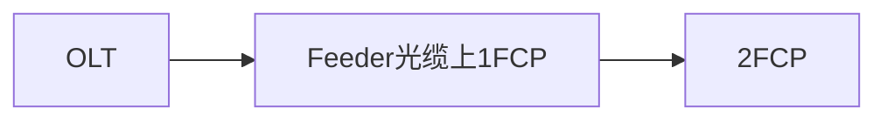
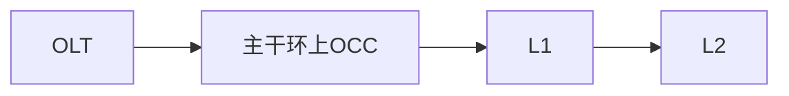
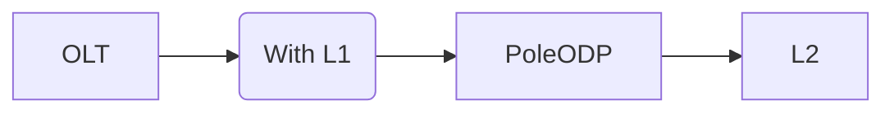
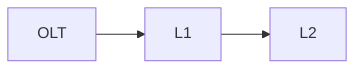

## 需求说明

设计中网格是一个很重要的设计元素，他的作用主要包括：

*   标识范围，用来确定不同网络层级之间的包含，相交关系
*   确定关键的地址覆盖关系
*   设计过程中作为一个重要的参考项，从而支持从下往上的设计

但是系统中目前网格的定义较为含糊，往往不好和客户解释，在此统一明确

## 项目中网格使用情况

### HO项目

主要网络架构为：

*   Cluster Grid
    HO特定概念
    表示一个1FCP的覆盖范围。这里涉及到地址覆盖，具有业务含义。同时用来做子工程拆分，用来进行项目协作。
*   Feeder Grid
    HO特定概念
    此网格没有业务含义，只是纯粹为了新建一个子工程。用来做项目协作。
    HO中CO到出局第一个Chamber，Feeder光缆路由范围，以及MDU Building都采用这个网格来圈定并创建子工程。
*   Hyperzone
    HO特定概念
    表示一个工程立项时的工程范围。
*   Exchange Area
    HO特定概念
    表示一个CO的覆盖范围，这个数据是属于基础数据，由于OLT已经规划好了，所以其覆盖范围也已经早已确定。

**HO这里需要特殊说明如下**：
HO的2FCP没有对应的网格，主要是因为其设计采用的是XCite的自动设计，直接用UPRN\_TABLE来进行覆盖设备和地址的管理，而没有使用网格。
所以其实从逻辑上来说，这里应该也有一个覆盖设备和地址关系的网格逻辑。

### 泰国true项目

主要网络架构为：

*   OLT Grid
    因为泰国的设计是一个CO覆盖作为一个项目，所以，OLT Grid在true项目中，既表示一个工程的范围，也表示一个CO的覆盖范围。

*   OCC Grid
    表示一个主干环OCC的覆盖范围，这里是为了更好的进行项目的拆分，进行多人协作。

*   ODB Grid (ODB网格）
    表示一个2级分光器的覆盖范围。主要用来做地址覆盖。

### 孟加拉项目

主要网络架构为：

*   OLT Grid
    孟加拉的设计也是一个CO覆盖作为一个项目，所以，OLT Grid在孟加拉项目中，既表示一个工程的范围，也表示一个CO的覆盖范围。

*   OCC Grid
    会在设计中进行OCC的划分，用来确定管理区域，也可以用来作为子工程的设计区域。

*   Pole ODP Coverage
    表示一个Pole ODP的覆盖范围，作为最下级的覆盖范围。也可用来作为子工程的设计区域。

**孟加拉这里需要特殊说明如下**：
孟加拉的2级分光器没有对应的网格，主要是因为其采用的是Excel的方式进行地址覆盖的管理，而没有使用网格。
所以其实从逻辑上来说，这里应该也有一个覆盖设备和地址关系的网格逻辑。

### ZTE HLD团队

根据设计方案不同有所区别，但是大部分逻辑是采取2级分光：

*   待设计区域
    当前工程接收到的待设计区域，表示当前工程的范围。

*   CO覆盖区域
    ZTE HLD团队接收到一个项目后，如果项目区域较大，需要划分多个CO来进行覆盖，则会绘制CO覆盖区域。同时也方便进行任务的拆分。

*   L2覆盖区域
    对于一个CO内的接入网设计，ZTE的方案一般都以2层为主，从下往上则先L2覆盖区域，用来按照用户分布情况结合设计准则，对L2分光区进行划分。
    这里已经涉及到了用户的覆盖。

*   L1覆盖区域
    有了L2覆盖区域之后，结合设计方案，将L2覆盖区域汇聚到L1覆盖区域，方便进行用户覆盖的统计。

### ZTE Mexico LLD团队

根据用户的项目不同，绘制的网格不同，但是一定会绘制的包含：

*   待设计区域
    当前工程接收到的待设计区域，表示当前工程的范围。

*   覆盖网格
    表示一个用户接入区，表示一个接入设备所覆盖的用户的范围，

然后根据项目要求，可能会再中间加上一层网格：

*   Feeder路由网格
    表示Feeder的覆盖范围，用来汇聚当前feeder下所有连接的覆盖网格。

## 总结

可以看出，从网络覆盖角度看，根据局方管理上对于地址覆盖的管理，主要就1个维度。

*   覆盖网格
    表示一个用户接入区，表示一个接入设备所覆盖的用户的范围，这里的范围一般使用用户所在的建筑物的外包多边形表示。\
    这里的覆盖设备指的是开通过程中所关注的覆盖设备，一般情况为2级分光点，或者2级分光点下连的设备，比如ODB。
    但是，项目中，这个网格可能用户不会去绘制。

从任务拆分的角度来看，工程网格（待规划网格）是都会存在的，分为两种：

*   完全独立的区域（HO）
*   与CO覆盖范围一致，或者说就是以当前工程来完成一个CO的覆盖（孟加拉，true）

其内部具体设计任务所依赖的网格具体对应的业务含义可能存在不同，可能在：

*   和CO覆盖区域一致（孟加拉，true）
*   和主干路由的覆盖范围一致（HO）
*   一个包含CO和第一个离CO最近的一个chamber的小范围（HO）
*   MDU建筑物本身（HO）
*   和L1的覆盖范围一致（孟加拉，true，HO)
*   和L1的下沿节点一致（孟加拉）

从绘图的角度来看，分为以下几种：

*   CO覆盖范围（ZTE，孟加拉，true）
*   主分歧点覆盖范围（true是OCC，孟加拉，HO是L1, ZTE Mexico）
*   L2覆盖范围（true，ZTE，HO/孟加拉是逻辑上需要, ZTE Mexico）

## 设计

### 网格划分

基于以上的情况汇总，我们系统对网格的定义如下：
\*\* 工程划分相关：

*   Plan Grid（待规划网格）：一个工程的范围网格
*   Task Grid (任务单网格）：一个任务单所对应的设计网格，用来表示每个任务单对应的设计范围。这里的需要支持任务单网格类型的灵活配置。

\*\* 业务相关：

*   CO Coverage（CO覆盖）： 一个CO的覆盖范围，需要支持用户绘制，也需要支持导入。
*   Main Distribution Coverage（主分歧点覆盖）：主分歧点的覆盖范围
*   HP Coverage Grid（用户覆盖）:用户接入区，表示一个接入设备所覆盖的用户的范围。

### 和网格相关的关键流程

#### 立项（使用系统Plan发起立项）

1.  Planner在Plan界面，绘制一个待规划网格，填写相关信息，标识发起立项。
2.  Project Manager进入Project Management界面，查看到新的立项申请，进行工程模式的选择，并确定各个环节负责人，然后确定立项。同时创建一个设计任务单发给Design Manager。
3.  Design Manager进入Design Project Management界面，查看到新的设计任务，并可以查看到当前设计的范围（待规划网格）。

#### 立项（接收线下信息进行立项）

1.  Project Manager进入Project Management界面，根据接收到的立项信息（包括项目说明，设计准则，项目范围），新建项目。
2.  新建项目的界面中，可以打开地图，进行待规划网格的绘制。
3.  点击确定，发起立项。
4.  Design Manager进入Design Project Management界面，查看到新的设计任务，并可以查看到当前设计的范围（待规划网格）。

#### 设计准备
